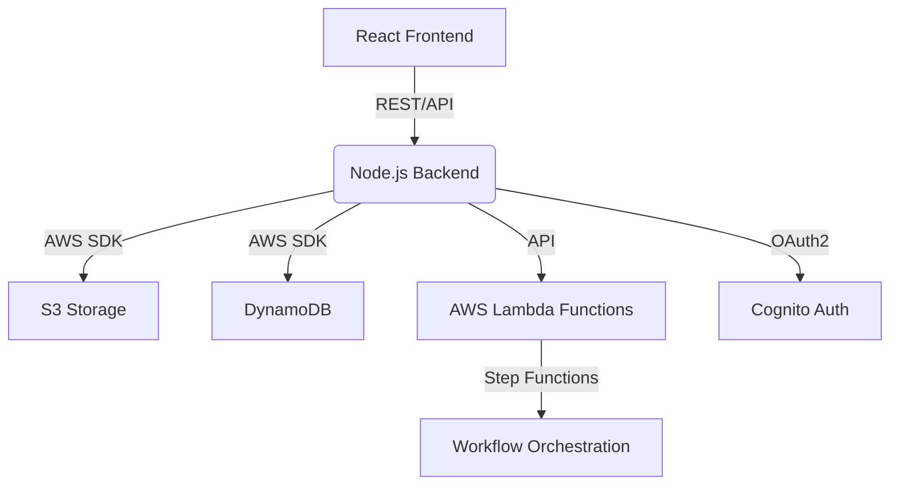

# 🚀 RAG-Based Document Intelligence Platform


<p align="center">
  
  
  
  
  
  
  
</p>

> **A full-stack, cloud-native platform for secure document upload, AI-powered summarization, and chat with your files—leveraging AWS, Node.js, and React.**

---

## 🧩 Architecture Overview



---

## ✨ Features
- **Secure Uploads:** Drag & drop PDFs, DOCX, CSV, and more. Stored in S3, tracked in DynamoDB.
- **AI Summarization:** Summarize folders or files using AWS Bedrock and Lambda.
- **Chat with Docs:** Ask questions, get instant answers from your own files.
- **Enterprise Security:** Cognito authentication, session management, and encrypted storage.
- **Smart Analytics:** Usage tracking, insights, and beautiful dashboards.
- **Modern UI:** Responsive React frontend with PDF highlighting and reference popups.

---

## 🚦 Quickstart

### 1. Clone the Repo
```sh
git clone https://github.com/your-org/rag-based-app.git
cd rag-based-app
```

### 2. Setup Environment
- Copy `.env.example` to `.env` in each service (backend, frontend).
- Fill in your AWS, Cognito, and server credentials.

### 3. Start Backend
```sh
cd backend
npm install
npm start
```

### 4. Start Frontend
```sh
cd frontend
npm install
npm start
```

### 5. Deploy AWS Lambda Functions
- See `AWS_backend/lambda_functions/` and deploy via AWS CLI or Console.

---

## 🗂️ Project Structure

```
AWS_backend/    # AWS Lambda & Step Functions
backend/        # Node.js Express API
frontend/       # React app
```

---

## 🛠️ Tech Stack
- **Frontend:** React, React Router, PDF.js, AWS Amplify
- **Backend:** Node.js, Express, AWS SDK, EJS
- **Cloud:** AWS Lambda, S3, DynamoDB, Cognito, Step Functions

---

## 📸 Screenshots
> _Add your own screenshots or GIFs here!_

---

## 🤝 Contributing
We love contributions! Please open issues, submit PRs, or suggest features.

---

## 📄 License
MIT

---

## 💬 Contact & Support
- [Issues](https://github.com/your-org/rag-based-app/issues)
- [Discussions](https://github.com/your-org/rag-based-app/discussions)

---

<p align="center"><b>Made with ❤️ for next-gen document intelligence</b></p>
