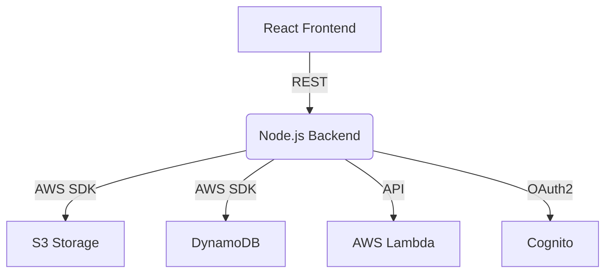

# 🛡️ Backend (Node.js) — RAG Application AWS

<p align="center">
  
  
  
  
  
</p>

> **The secure, scalable API and orchestration layer for your RAG-powered document intelligence platform.**

---

## 🏗️ Architecture



---

## 🚀 Features
- Secure authentication with AWS Cognito
- File upload/download to S3
- Metadata and user file tracking in DynamoDB
- API Gateway and Lambda integration for advanced workflows
- Session management and EJS server-side rendering
- Modular, extensible Express.js architecture

---

## 📂 Folder Structure

```
backend/
  app.js                # Main Express app entry point
  CONFIG_SETUP.md       # Configuration documentation
  package.json          # Dependencies and scripts
  config/               # AWS, Cognito, and app config
  controllers/          # (Reserved for future use)
  middleware/           # Auth/session middleware
  routes/               # API endpoints
  services/             # AWS/Cognito/API Gateway logic
  uploads/              # Temp file uploads
  utils/                # Logging and helpers
  views/                # EJS templates
```

---

## 🧩 Key Files & What They Do
- **app.js:** Bootstraps Express, session, CORS, view engine, and routes. Initializes Cognito.
- **config/index.js:** Loads all environment variables and exports config.
- **config/aws.js:** Sets up AWS SDK and S3 client.
- **config/cognito.js:** Cognito client config.
- **middleware/auth.js:** Auth/session middleware (checkAuth, requireAuth, updateTokenInfo).
- **routes/auth.js:** Login, callback, logout, home page.
- **routes/files.js:** File upload, download, listing, cache management.
- **routes/pdfProxy.js:** Proxies PDFs from S3 to avoid CORS.
- **routes/pdfSignedUrl.js:** Generates signed S3 URLs for PDFs.
- **routes/summaryRoutes.js:** Folder summary, caching, user session.
- **routes/tempPdfViewer.js:** Temp PDF storage and cleanup.
- **services/apiGatewayService.js:** API Gateway integration.
- **services/cognitoService.js:** Cognito OpenID Connect and token handling.
- **services/s3Service.js:** S3 folder/file management.
- **services/sessionService.js:** User session and info extraction.
- **utils/logger.js:** Token info logging and debugging.
- **views/home.ejs:** Main EJS template for home page.

---

## ⚡ Quickstart
1. Copy `example.env` to `.env` and fill in your AWS/Cognito/server credentials.
2. Install dependencies:
   ```sh
   npm install
   ```
3. Start the server:
   ```sh
   npm start
   # or for development
   npm run dev
   ```

---

## 🛠️ Tech Stack
- Node.js, Express.js, EJS
- AWS SDK (S3, DynamoDB, Cognito)
- Session, Multer, OpenID Client

---

## 📝 Tips & Best Practices
- Never commit `.env` or sensitive credentials.
- Use the `controllers/` folder for business logic as your app grows.
- The `uploads/` folder is for temp files—ensure it’s writable.
- All config is centralized in `config/` for easy management.

---

## 🛡️ Environment Variables & Configuration

This backend uses a centralized configuration system powered by environment variables. **You must create a `.env` file in the backend directory before running the server.**

### 1. Copy the Example File
```sh
cp backend/example.env backend/.env
```

### 2. Edit `.env` with Your Credentials
Below are the required environment variables:
```env
# AWS S3 Configuration
AWS_REGION=your-aws-region
AWS_ACCESS_KEY_ID=your-aws-access-key-id
AWS_SECRET_ACCESS_KEY=your-aws-secret-access-key
S3_BUCKET_NAME=your-s3-bucket-name

# DynamoDB Configuration
DYNAMODB_TABLE_NAME=userFiles

# AWS Cognito Configuration
COGNITO_CLIENT_ID=your-cognito-client-id
COGNITO_CLIENT_SECRET=your-cognito-client-secret
COGNITO_USER_POOL_ID=your-cognito-user-pool-id
COGNITO_REGION=your-cognito-region
COGNITO_REDIRECT_URI=http://localhost:3001/callback

# Server Configuration
PORT=3001
SESSION_SECRET=your-secure-session-secret-key

# CORS Configuration
CORS_ORIGINS=http://localhost:3000,https://your-api-gateway-url.execute-api.region.amazonaws.com
```

> **Never commit your `.env` file to source control!**

For more details, see [`CONFIG_SETUP.md`](./CONFIG_SETUP.md).

---

## 🤝 Contributing
We welcome PRs, issues, and suggestions! See the root README for details.

---

<p align="center"><b>Backend: The engine behind your document intelligence platform.</b></p>
