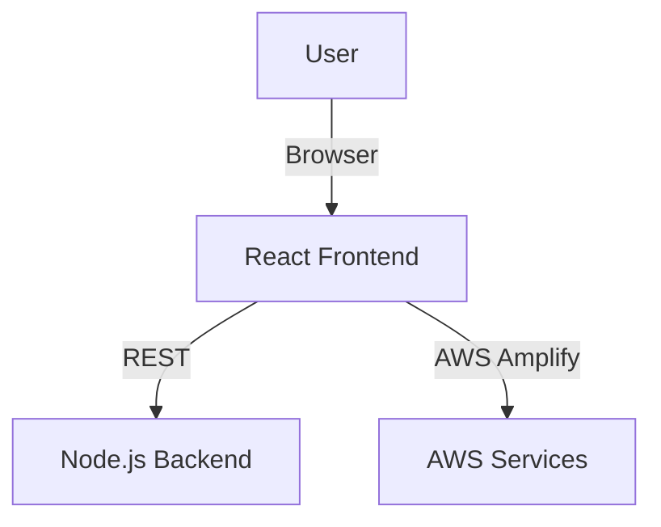

# 💎 Frontend (React) — RAG Application AWS

<p align="center">
  
  
  
  
</p>

> **A beautiful, modern UI for uploading, summarizing, and chatting with your documents—powered by React and AWS.**

---

## 🏗️ UI Architecture



---

## ✨ Features
- Drag & drop uploads for PDFs, DOCX, CSV, and more
- Chat with your documents using AI
- PDF highlighting, reference popups, and summary tables
- Secure authentication via AWS Cognito
- Responsive, mobile-friendly design
- Smart API caching and error boundaries

---

## 📂 Folder Structure
```
frontend/
  package.json           # Project dependencies and scripts
  public/                # Static assets (HTML, icons, manifest, etc.)
  src/                   # Source code (React components, styles, utils)
    App.jsx              # Main app component, routing, authentication
    index.js             # Entry point, renders App
    components/          # UI components (ActionCenter, Home, Summary, etc.)
    utils/               # Utility functions (API cache, event service, etc.)
  scripts/               # (Reserved for custom scripts)
  rag/                   # (Reserved for RAG-specific logic)
  .env                   # Environment variables (not committed)
```

---

## 🧩 Key Components
- **App.jsx:** Main app logic, routing, authentication state, and layout.
- **components/ActionCenter/:**
  - `LeftPanel.jsx`, `MiddlePanel.jsx`, `HomeSection.jsx`: Layout/navigation panels.
  - `Summary/`: Summary display, PDF highlighting, reference popups, and table views.
- **components/Home/HomePage.jsx:** Landing page with feature highlights and authentication state.
- **utils/apiCache.js:** Handles API response caching with TTL and localStorage support.

---

## ⚡ Quickstart
1. Install dependencies:
   ```sh
   npm install
   ```
2. Start the development server:
   ```sh
   npm start
   ```
   The app will run on [http://localhost:3000](http://localhost:3000) by default.
3. Build for production:
   ```sh
   npm run build
   ```

---

## 🛠️ Tech Stack
- React 19, React Router, PDF.js, AWS Amplify
- FontAwesome, Axios, XLSX

---

## 📸 Screenshots
> _Add your own screenshots or GIFs here!_

---

## 📝 Tips & Best Practices
- All environment variables (API endpoints, AWS config) should be set in the `.env` file (not committed).
- The `rag/` and `scripts/` folders are reserved for future expansion.
- Use the `utils/` folder for shared logic and caching.

---

## 🛡️ Environment Variables & Configuration

This frontend uses environment variables for API endpoints and AWS configuration. **You must create a `.env` file in the frontend directory before running the app.**

### 1. Example `.env` file
```env
REACT_APP_API_URL=http://localhost:3001
REACT_APP_BACKEND_URL=http://localhost:3001
```

> **Never commit your `.env` file to source control!**

You can add more variables as needed for your deployment (e.g., AWS Amplify, Cognito, etc.).

---

## 🤝 Contributing
We welcome PRs, issues, and suggestions! See the root README for details.

---

<p align="center"><b>Frontend: The face of your document intelligence platform.</b></p>
